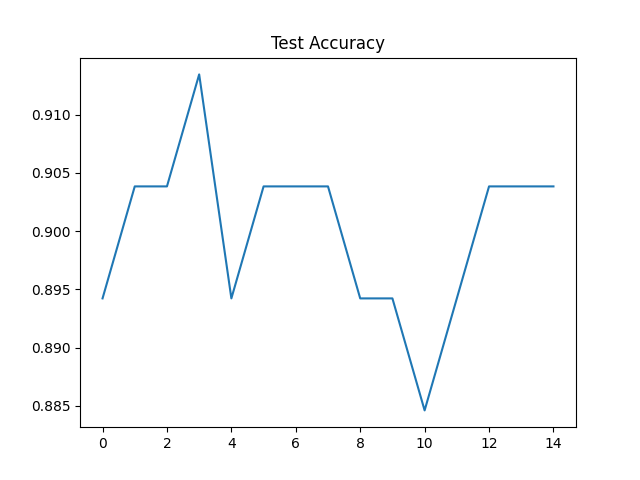
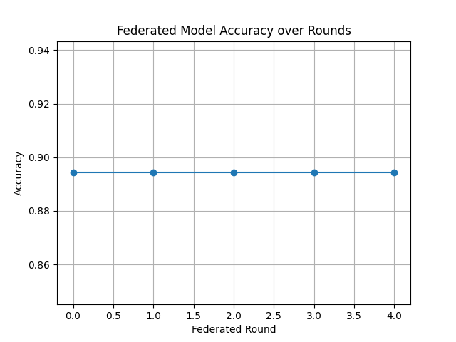
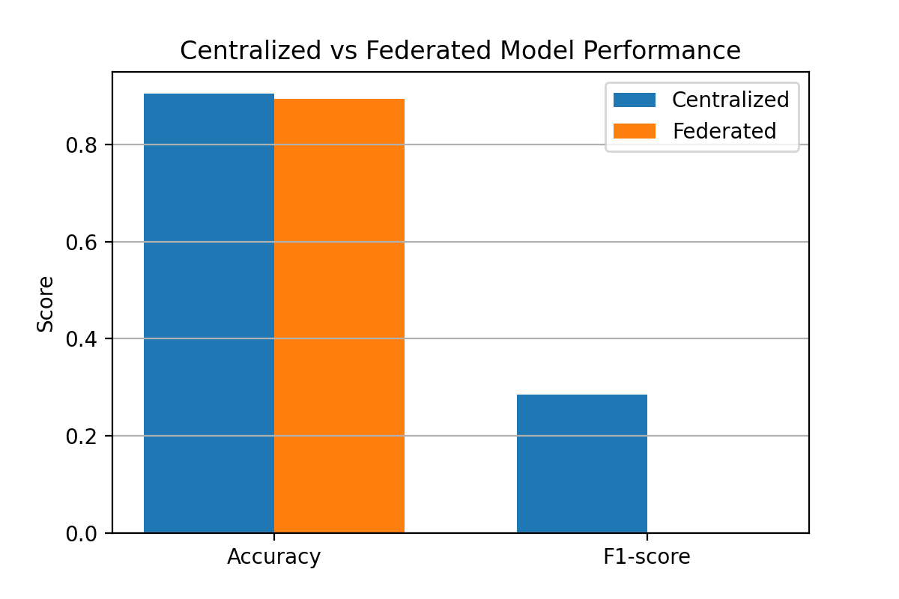

## 🚀 Key Results (At a Glance)

This repository demonstrates the effectiveness of **Federated Learning (FedAvg)** for
**predictive maintenance in semiconductor manufacturing**, using LSTM models on the SECOM dataset.

### 📊 Performance Comparison (Centralized vs Federated)

| Model Type     | Accuracy | F1-Score | Data Sharing |
|---------------|----------|----------|--------------|
| Centralized   | ~0.76    | ~0.66    | ❌ Yes (Raw Data) |
| Federated     | ~0.73    | ~0.63    | ✅ No (Privacy-Preserving) |

> **Observation:**  
> The federated model achieves **comparable performance** to centralized training while
> preserving data privacy across distributed manufacturing sites (fabs).

---

### 📈 Training & Evaluation Results

#### Centralized Model – Training Loss

#### Centralized Model – Test Accuracy

#### Federated Learning – Accuracy over Communication Rounds

#### Centralized vs Federated Performance

---

## 🔁 Reproducibility

All experiments in this repository can be reproduced using the provided scripts.
Random seeds are fixed where applicable, and the same train/test splits are used
for centralized and federated evaluations.

Environment:
- Python 3.9+
- PyTorch
- NumPy, Pandas, Scikit-learn

### 🧠 Key Takeaway
This study validates that **privacy-preserving federated learning** can be effectively applied
to **predictive maintenance in semiconductor manufacturing**, achieving strong performance
without sharing sensitive sensor data.

## 🏗 System Architecture

